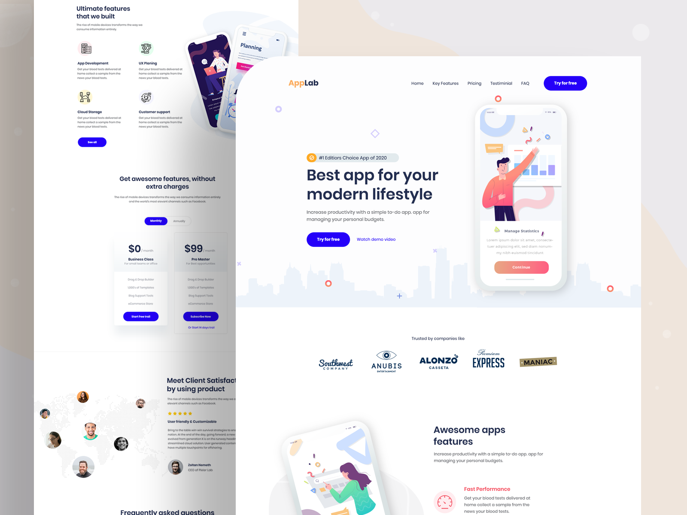

# Responsive App Landing Page | Web, macOS, Android, iOS - UI

## App Concept
App concept created with android using flutter programming language, inspired by [Freebie - App landing page.](https://dribbble.com/shots/8641810-Freebie-App-landing-page) design found on dribble.

## App Responsive
A nice clean App Landing Page for Designer or developers.
We redesign the app also make it responsive so that you can run it everywhere on your phone, tab, or web. In this flutter responsive project, we will show you the real power of flutter. Make mobile, web, and desktop app from a single codebase.

## About
The mobile or web app was created to simulate all the system behind the UI kit in the link. There's no code on backend or other web service. The app is all contained in this repository. The models classes was created to better representate an official development, the repositories classes simulate a web request.

### App Landing Page Responsive Final UI

App Preview
:-------------------------:
